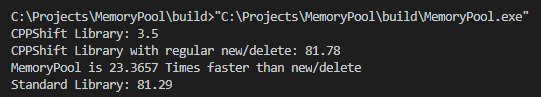
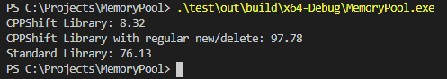
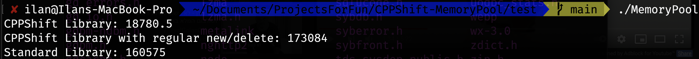

# MemoryPool For C++
A very fast cross-platform memory pool mechanism for C++ built using a data-oriented approach.
I hope this simple feature will help you increase your software's performance - and there are more projects and features to come under the CPPShift library name, wait for it ;)

# Table of Contents
- [MemoryPool For C++](#memorypool-for-c)
- [Table of Contents](#table-of-contents)
- [Usage](#usage)
  - [Memory scoping](#memory-scoping)
  - [Macros](#macros)
- [Methodology](#methodology)
  - [MemoryPool data (MemoryPool)](#memorypool-data-memorypool)
  - [Memory Block (SMemoryBlockHeader)](#memory-block-smemoryblockheader)
  - [Memory Unit (SMemoryUnitHeader)](#memory-unit-smemoryunitheader)
  - [Memory Scope (SMemoryScopeHeader)](#memory-scope-smemoryscopeheader)
- [Benchmark](#benchmark)
  - [Windows & CLang](#windows--clang)
  - [Windows & MSVC](#windows--msvc)
  - [MacOS & CLang](#macos--clang)
- [About](#about)
- [Contributors - Thank You! :D](#contributors---thank-you-d)
- [More to come in later versions](#more-to-come-in-later-versions)

# Usage
To use the memory pool features you just need to copy the [MemoryPool.cpp](MemoryPool.cpp), [MemoryPool.h](MemoryPool.h) & [MemoryPoolData.h](MemoryPoolData.h) files to your project. The memory pool structure is `CPPShift::Memory::MemoryPool`. ***The Memory Pool Is Not Thread Safe - In case of threads it is better to create a memory pool for each thread***

 * _Create a memory pool_: `CPPShift::Memory::MemoryPool * mp = new CPPShift::Memory::MemoryPool(size);` Create a new memory pool structure and a first memory block. If you don't specify a size then by default it will be the `MEMORYPOOL_DEFAULT_BLOCK_SIZE` macro.
 * _Allocate space_: `Type* allocated = new (mp) Type[size];` or `(Type*) mp->allocate(size * sizeof(Type));` or `mp->allocate<Type>(size);` Where `Type` is the object\primitive type to create, `mp` is the memory pool object address, and `size` is a represention of the amount of types to allocate.
 * _Deallocate space_: `mp->free(allocated)` Remove an allocated space
 * _Reallocate space_: `Type* allocated = (Type*) mp->reallocate(allocated, size);` Rellocate a pre-allocated space, will copy the previous values to the new memory allocated.
 * _Dump data of a memory pool_: `mp->dumpPoolData()` This function prints outs the data about the blocks and units in the pool.

## Memory scoping
Scoping is a fast way to deallocate many allocations at once. If for example you need to allocate more than once in a given part of the code, and then you deallocate all the allocations that happaned, then you can "scope" all these allocations together. it works the same way as a stack in a function scope.

 * _Start A Scope_: `mp->startScope()` where mp is the memory pool structure. This function creates a "checkpoint" of the offset and block in the memory pool.
 * _End A Scope_:  `mp->endScope()` Will free all the allocations made after the scope started.
 * _Scope Inside A Scope_: You can nest scopes inside scopes by strating a new scope again, just the same way that the stack works with function scopes. Each scope is pointing to the previous one to create a chain that allows the memory pool manager to manage scope nesting.

## Macros
There are some helpful macros available to indicate how you want the MemoryPool to manage your memory allocations.
 * `#define MEMORYPOOL_DEFAULT_BLOCK_SIZE 1024 * 1024`: The MemoryPool allocates memory into blocks, each block can have a maximum size avalable to use - when it exceeds this size, the MemoryPool allocates a new block - use this macro to define the maximum size to give to each block. By default the value is `1024 * 1024` which is 1MB.

# Methodology
The MemoryPool is a structure pointing to the start of a chain of blocks, which size of every block is by default `MEMORYPOOL_BLOCK_MAX_SIZE` macro (See [Macros](#macros)) or the size passed into the `CPPShift::Memory::MemoryPool(size)` constructor. The MemoryPool is an object holding the necessary functions to work with the a memory pool. What's also good is that you can also access the MemoryPool structure data directly if needed (everything is public).

## MemoryPool data (MemoryPool)
The memory pool structure holds meta-data about the memory space that is allocated and stored in the pool.
 * `SMemoryBlockHeader* firstBlock;` - Holds the first block in the chain of memory blocks.
 * `SMemoryBlockHeader* currentBlock;` - Holds the last block in the chain that is used first for allocating (allocations are happening in a stack manner, where each memory unit allocated is on top of the previous one, when a block reaches it's maximum size then a new block is allocated and added to the block chain of the pool).
 * `size_t defaultBlockSize;` - Default size to use when creating a new block, the size is defined by the `MEMORYPOOL_BLOCK_MAX_SIZE` macro or by passing the `size` as a parameter for the `CPPShift::Memory::MemoryPoolManager::create(size)` function.
 * `SMemoryScopeHeader* currentScope;` - A pointer to the current scope in the memory pool.

## Memory Block (SMemoryBlockHeader)
Each block contains a block header the size of 56 bytes containing the following information:
 * `size_t blockSize;` - Size of the block
 * `size_t offset;` - Offset in the block from which the memory is free (The block is filled in sequencial order)
 * `SMemoryBlockHeader* next;` - Pointer to the next block
 * `SMemoryBlockHeader* prev;` - Pointer to the previous block
 * `size_t numberOfAllocated` - Number of units currently allocated in this block. Helps smart garbage collection when block data has been freed.
 * `size_t numberOfDeleted` - Number of units that have been flaged as deleted. The system removes blocks by comparing the deleted with the allocated.

When a block is fully filled the MemoryPool creates a new block and relates it to the previous block, and the previous to the current, them uses the new pool as the current block.

## Memory Unit (SMemoryUnitHeader)
When allocating a space, MemoryPool creates a SMemoryUnitHeader and moves the blocks offset forward by the header size plus the amount of space requested. The header is 16 bytes long and contains the following data:
 * `size_t length;` - The length in bytes of the allocated space
 * `SMemoryBlockHeader* container` - Block which this unit belongs to

## Memory Scope (SMemoryScopeHeader)
A scope has it's own structure - it has an offset and a pointer to the starting block of the scope, and also a pointer to the previous scope (parent).
 * `size_t scopeOffset;` - Saves the offset of the block when start scope is declared.
 * `SMemoryBlockHeader* firstScopeBlock;` - Saves the current block when a start scope is declared, helps to know until which block to free everything when the scope ends.
 * `SMemoryScopeHeader* prevScope;` - Pointer to the previous scope/NULL if no parent scope is present.

# Benchmark
## Windows & CLang
 
About 21-24 times faster than standard new/delete in each test.

## Windows & MSVC
 
About 10-13 times faster than standard new/delete in each test.

## MacOS & CLang
 
About 8-10 times faster than standard new/delete in each test.

# About
- ***Sapir Shemer*** is the proud business owner of [DevShift](https://devshift.biz) and an Open-Source enthusiast. Have been programming since the age of 7. Mathematics Student :)

# Contributors - Thank You! :D
A list of people that were kind enough to help:
- [pwc357](https://github.com/pwc357)
- [MyraBaba](https://github.com/MyraBaba)
- [LastThought](https://www.reddit.com/user/LastThought/)
- [azureskydiver](https://github.com/azureskydiver)

# More to come in later versions
In the next versions I'm planning to add some interesting features:
- Ability to put thread safety on the memory pool to make a thread shared memory pool.
- Ability to create an inter-process memory pool which can be shared between different processes.
- `compressGarbage()`: Will compress deleted units that are next to eachother into one unit.
